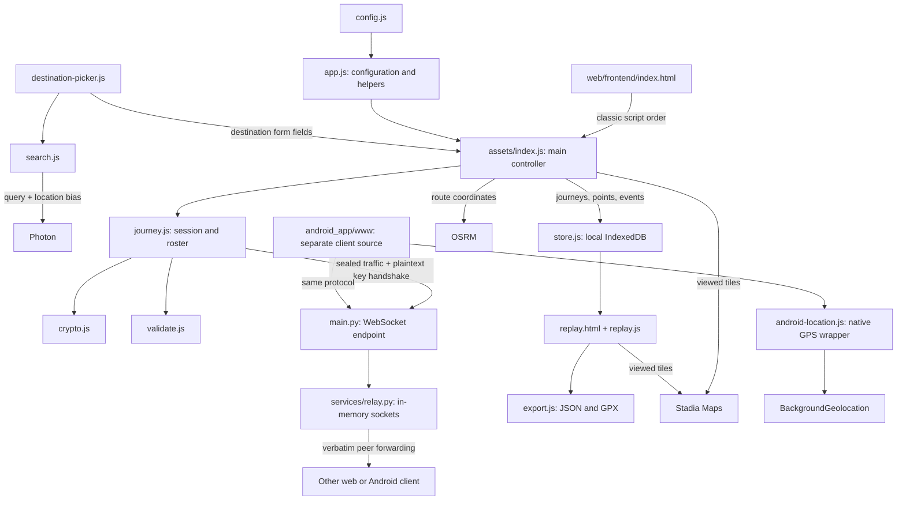

# Waysera knowledge graph

Waysera is a group navigation app with an independently maintained browser client, a Capacitor Android client, and a FastAPI WebSocket relay. Clients own journey creation, cryptography, admission, map/navigation UI, participant state, recording, replay, and export. The relay maintains only a process-local channel/socket registry and forwards text frames.

This map describes the **current working tree**, including existing uncommitted edits and nonignored new files, on 2026-09-12. Application files were inspected without changing their behavior. The graph generator captures the base Git commit and a SHA-256 for each inventoried file, so the snapshot can be compared with later edits.

## Explore the artifacts

- [Interactive graph](index.html): open in a browser, search for a file, inspect incoming/outgoing edges and source evidence, or find the shortest connection between two artifacts. It works without a server or external libraries.
- [Complete artifact inventory](artifacts.md): every in-scope file, connection counts, byte comparisons between clients, and unresolved local references.
- [Journey protocol and local data](protocol.md): admission, message flow, storage schema, recording and test coverage.
- [Platforms and deployment](platforms.md): Android packaging/resources, source copies, operations and brand relationships.
- [Machine-readable graph](graph.json): all nodes, typed edges, source lines, hashes, comparison results and scope metadata.

The graph distinguishes file references, reviewed behavior, content equality, build conventions, and structural grouping. Arrows read **source → relation → target**, so an arrow can mean “loads,” “records,” “implemented by,” or “belongs to”; it is not necessarily the direction of data transmission. Undirected path search finds relationships traversed backward too, and labels those steps. Structural group edges are off by default to avoid paths that connect files only through their category.

## Architecture



The main entry is [index.html:326](../../web/frontend/index.html#L326), whose ordered classic scripts expose global namespaces and functions. There is no frontend module bundler. [index.js:73](../../web/frontend/assets/index.js#L73) is the main controller; [app.js:15](../../web/frontend/assets/app.js#L15) supplies shared configuration and helpers. This distinction matters when deciding which artifact a feature change touches.

## Common traces

| User action | Traced artifacts |
| --- | --- |
| Choose a destination | `destination-picker.js` → `search.js` → Photon; picker fills the fields consumed by `index.js` |
| Create a journey | `index.js` → `crypto.js` generates code/key → `store.js` persists journey → `journey.js` opens hashed channel |
| Join by invitation | `crypto.js` parses URL fragment → `index.js` imports/stores key → `journey.js` announces to peers |
| Join by code | `journey.js` sends plaintext ECDH request → controller shows Allow/Deny → `crypto.js` wraps shared key → joiner can decrypt |
| Share locations/messages | Browser GPS or Android wrapper → controller → session seals message → relay forwards → peer decrypts/validates → UI and recording |
| Navigate | `index.js` → Leaflet Routing Machine → OSRM; map tiles come from Stadia; voice guidance uses browser speech synthesis |
| Replay/export | Local `journeys` + `points` + `events` → `replay.js` interpolation/map → `export.js` → JSON/GPX; replay basemap still requests tiles |
| Build Android | `build-apk.sh` → `cap sync` of Android `www` → native assets/plugin integration → Gradle → debug APK |
| Deploy relay | Render blueprint → requirements/Uvicorn, or Fly configuration → Dockerfile → requirements + main/services → one relay worker |

Detailed evidence for these traces appears in [protocol.md](protocol.md), [platforms.md](platforms.md), and each graph edge. Suggested explorer paths: `web/frontend/index.html` → `web/backend/services/relay.py`; `android_app/build-apk.sh` → `app-debug.apk`; `web/frontend/assets/index.js` → `GPX download` with arrow direction disabled to follow the recording/replay relationship backward where necessary.

## What the connections reveal

1. **Client changes can require two edits.** `android_app/www` is source, not output generated from `web/frontend`. The same-relative comparison found 15 identical pairs and five divergent pairs. Identical bytes express current correspondence, not an automatic update path.
2. **Encryption has a distinct admission path.** Sealed journey messages carry positions and other journey state. Code-only `{hs}` handshakes expose names/member IDs and public keys; the group key is wrapped. Display-name approval is not cryptographic authentication against an active relay. The code documents this distinction; some introductory descriptions are broader.
3. **Local history drives replay and export.** There is no server history fetch. Each origin/profile has local recordings; tabs sharing both share IndexedDB. Export omits the journey key. No JSON import UI or service worker was found in this snapshot.
4. **Maps/search/routes cross a separate boundary.** Photon receives search text and optional location bias, Stadia receives tile requests, and OSRM receives route coordinates. These calls bypass the journey relay.
5. **Deployment depends on process locality.** The socket registry is an in-memory dictionary. The Dockerfile selects one worker; independent workers or machines would split channels without added coordination. Deployment files describe intent, not verified live infrastructure.

## Rebuild and extend

From the repository root:

```bash
python3 tools/build_knowledge_graph.py
```

The generator uses only the Python standard library and Git. It reads current files and writes `graph.json`, `artifacts.md`, and `index.html` in this directory. It does not launch the application, install packages, deploy infrastructure, or contact external services.

[relationships.json](relationships.json) supplies reviewed semantic relationships that cannot be recovered from file references alone. Each entry names a source file and an exact substring anchor; rebuilding resolves that anchor to its current line and fails if it no longer exists. Review these relationships when behavior changes: an unchanged anchor is evidence that a location still exists, not proof that the original interpretation remains correct. [explorer.template.html](explorer.template.html) supplies the presentation, with one `__GRAPH_JSON__` placeholder. Edit the template rather than the generated explorer.

The extractor reads HTML script/style/image links, selected named JavaScript globals, literal asset/navigation references, local Python `from` imports, Android XML resource references, dependency declarations and native package links. Client copy relationships use matching paths and SHA-256 equality. It is intentionally a **file/reference and behavior graph**, not a full function call graph or a runtime trace. JavaScript global references are lexical; they can identify a dependency without proving execution or coverage of every branch.

The inventory includes existing tracked files and nonignored additions. It excludes its own graph documents/tool and files already deleted from the working tree. Current Git ignore rules omit dependencies, generated builds, caches, local environment files, blog drafts and screenshots; tracked files remain included regardless of ignore rules. There is no content-based secret detector. Expected build outputs appear as conceptual output nodes rather than thousands of generated files. Ignore files and empty package initializers have structural membership only where no semantic reference was discovered; that absence is explicit in the inventory.

## Validation

Rebuilding validates endpoint IDs, complete in-scope file coverage, and every evidence file/line before writing output. At delivery, the graph contains 136 files, 202 total nodes and 532 relationships, including structural membership and copy correspondence. Two consecutive rebuilds produced identical output hashes, and all 260 Markdown artifact/evidence links resolved. The graph was independently reviewed against source, including the admission boundary, Android bridge/build distinction, and IndexedDB relationships.

The explorer was exercised in headless Chrome: search, type filtering, artifact selection, evidence links, directed paths, absent directed paths, reverse undirected paths, and group membership toggling. Desktop (1440 px) and mobile (375 px) checks found no document overflow or runtime exceptions; the mobile graph scrolls inside its own panel. Application test suites are mapped as artifacts; this documentation task does not claim they were executed or passed.
