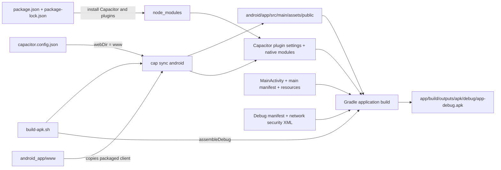
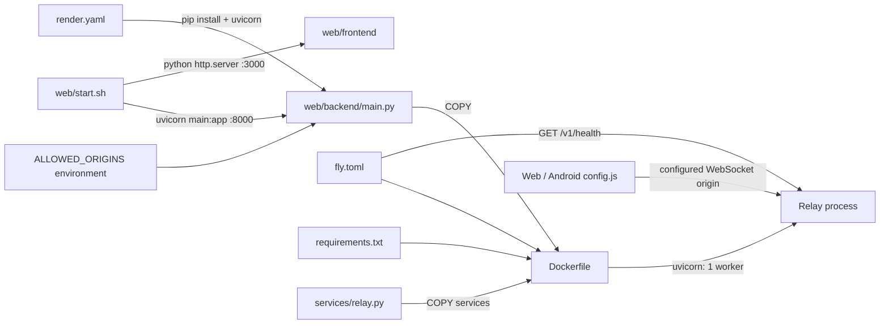

# Platform, packaging, and deployment trace

Snapshot: 2026-09-12. This is a static analysis of the working tree, including modified and untracked files. No build, deployment, or network verification was performed. Paths below are repository relative; line numbers refer to this snapshot.

## Android build graph

`www` is an independently maintained source tree. There is no build edge copying `web/frontend` into it (`android_app/build-apk.sh:5`, `android_app/.gitignore:13`, `DEVELOPING.md:64`). The copies' content equality is a relationship, not proof of a generation pipeline.

| Source | Relationship | Target / evidence |
| --- | --- | --- |
| `android_app/build-apk.sh` | Reads Android runtime config; pins Java and SDK; runs sync then build | `www/assets/config.js:24,29` in the script; Java 21 at script line 15; SDK home at 16; `npx cap sync android` at 35; `./gradlew assembleDebug` at 38; APK path at 40 |
| `android_app/capacitor.config.json:2` | Declares native identity and packaged web root | `com.waysera.app`; `appName=Waysera`; `webDir=www` at 4; WebView scheme `http` at 6 |
| `android_app/package.json:14` | Declares installed native dependencies | Capacitor Android/core, background-geolocation, app, geolocation, haptics, share, status-bar; CLI at 25; exact resolutions in `package-lock.json` |
| `android_app/android/settings.gradle:1` | Includes native modules and generated settings | `:app`, Cordova compatibility module, then `capacitor.settings.gradle` at 5 |
| `android_app/android/capacitor.settings.gradle:2` | Maps Gradle modules to npm package Android directories | Capacitor core at 3 and each plugin at lines 6–21 |
| `android_app/android/app/build.gradle:5` | Consumes SDK versions and Gradle dependencies | Root `variables.gradle`: min SDK 24, compile/target SDK 36; app dependencies at 33; generated `capacitor.build.gradle` applied at 45 |
| `android_app/android/build.gradle:10` | Selects Android Gradle Plugin and shared variables | AGP 8.13.0; `variables.gradle` applied at 18 |
| `android_app/android/app/capacitor.build.gradle:5` | Requires Java 21 and links plugins | Java target at 6, Cordova variables at 10, plugin dependencies at 12–17 |
| `android_app/android/gradlew:216`, `gradlew.bat:77` | Launch Gradle wrapper JAR | `gradle/wrapper/gradle-wrapper.jar`; wrapper properties line 3 selects Gradle 8.14.3 |
| `android_app/android/app/build.gradle:22` | References release shrinker configuration | `proguard-rules.pro`; release has `minifyEnabled false` and no signing configuration |

The installed npm modules, generated public assets, generated Capacitor config/plugin JSON, generated `res/xml/config.xml`, Cordova compatibility module, and debug APK all existed locally during this inspection. They are ignored build/dependency artifacts (`android_app/android/.gitignore:23,93,96,99`), not maintained source files. Their presence does not establish that they match the current sources.

## Android runtime and resources

| Source | Relationship | Target / evidence |
| --- | --- | --- |
| Main manifest `android_app/android/app/src/main/AndroidManifest.xml:14` | Launches activity | `java/com/waysera/app/MainActivity.java:5`, a minimal subclass of Capacitor `BridgeActivity` |
| Main manifest lines 6–16 | Resolves icon, name, and theme resources | `@mipmap/ic_launcher`, `@mipmap/ic_launcher_round`, `values/strings.xml`, `values/styles.xml` |
| `res/mipmap-anydpi-v26/ic_launcher.xml:3` and `ic_launcher_round.xml:3` | Assemble adaptive icons | `drawable/ic_launcher_background.xml` + `drawable/ic_launcher_foreground.xml`; foreground also supplies monochrome icon |
| `res/values/styles.xml:19` | Selects splash drawable | `@drawable/splash` at 20; Android selects the matching default/portrait/landscape/density PNG resource |
| Main manifest line 43 | Configures FileProvider shareable paths | `res/xml/file_paths.xml`, with external and cache paths |
| Debug manifest `src/debug/AndroidManifest.xml:11` | Overlays network policy only for debug build | `src/debug/res/xml/network_security_config.xml:19` permits cleartext for 10.0.2.2, 10.0.3.2, localhost, 127.0.0.1 |
| `android_app/www/index.html:319` | Loads controller before native location wrapper | `assets/index.js` then `assets/android-location.js` at 320 |
| `android_app/www/assets/android-location.js:21` | Uses native plugin and replaces browser hooks | `BackgroundGeolocation`; captures web start/stop at 27–28; overrides start at 52 and stop at 100 |
| Native location wrapper lines 55–75 | Starts foreground service and forwards coordinates | `addWatcher`, visible notification, permission request, 10 m filter; calls controller `publishPosition` at 75 |
| Native location wrapper lines 89,96,105,108 | Falls back to web tracking and cleans up | Captured web start, plugin `removeWatcher`, captured web stop |
| Main manifest lines 55–69 | Declares location, foreground-service, notification and wake-lock permissions | Supports Android tracking/navigation behavior; declaration alone does not verify runtime permission handling |
| `android_app/www/assets/polish.js:24` | Uses haptics plugin | `Haptics.notification` at 39, `Haptics.impact` at 41; wraps create, quick-message, navigation, and arrival UI actions |
| `android_app/www/assets/index.js:65` | Uses public origin for invite URLs | `WAYSERA_CONFIG.PUBLIC_ORIGIN`; creates invite at 120, shares current journey invite at 2039 |

The app, geolocation, share, and status-bar packages are installed and linked, but no direct runtime calls to those four Capacitor plugins were found in the application JS. Do not infer feature implementation from a package declaration. `layout/activity_main.xml:7` has a tooling context reference to MainActivity and contains a WebView; MainActivity itself does not call `setContentView`.

The main manifest deliberately has no HTTPS deep-link intent filter (`src/main/AndroidManifest.xml:25`). Its comment requires an incoming-URL handler and `assetlinks.json` together before restoring that capability. A configured public invite origin therefore does not imply Android app-link handling.

## Web and Android source comparison

Byte-for-byte comparison by the same relative path under `web/frontend` and `android_app/www` found 20 matched paths: **15 identical and 5 divergent**. There are **10 Android-only paths and 7 web-only paths**. Five identical paths are currently untracked on the web side.

| Class | Relative paths |
| --- | --- |
| Identical application files (10) | `assets/app-mobile.css`, `assets/app.js`, `assets/crypto.js`, `assets/destination-picker.js`, `assets/export.js`, `assets/journey.js`, `assets/replay.js`, `assets/search.js`, `assets/store.js`, `assets/validate.js` |
| Identical images (5) | `assets/vendor/images/marker-icon-2x-green.png`, `marker-icon-2x-grey.png`, `marker-icon-2x-orange.png`, `marker-icon-2x-red.png`, `marker-shadow.png` (all under the same images directory) |
| Divergent (5) | `assets/config.js`, `assets/index.js`, `assets/polish.js`, `index.html`, `replay.html` |
| Android-only (10) | `assets/android-location.js`; vendor `leaflet.js`, `leaflet.css`, `leaflet-routing-machine.js`, `leaflet-routing-machine.css`, `leaflet.rotatedMarker.js`; vendor images `layers-2x.png`, `layers.png`, `marker-icon-2x.png`, `marker-icon.png` |
| Web-only (7) | `assets/brand/favicon.svg`, `assets/brand/waysera-app-icon.svg`, `assets/brand/waysera-lockup.svg`, `assets/brand/waysera-mark.svg`, `manifest.webmanifest`, `tests.html`, `tests.js` |

The five divergent relationships have concrete reasons:

- `config.js`: Android sets an emulator relay URL and adds `PUBLIC_ORIGIN`; the web relay URL is empty and uses the host fallback. Both have an empty Stadia key.
- `index.js`: Android adds `inviteOrigin()` and substitutes it in both invitation creation sites. The rest currently matches.
- `polish.js`: Android adds Capacitor haptics and arrival feedback around the common skeleton/sheet behavior.
- `index.html`: Android loads bundled Leaflet, routing-machine, and rotated-marker scripts/CSS, adds `android-location.js`, and omits web metadata/favicon/manifest.
- `replay.html`: Android loads bundled Leaflet assets and omits the web favicon.

Web `index.html:28–32` loads Leaflet 1.9.4 from cdnjs and routing-machine 3.2.12 / rotatedmarker 0.2.0 from unpkg. Android `index.html:13–17` resolves local vendor equivalents. Both controllers use local marker PNGs: web `assets/index.js:492–493,538–542`; Android lines 504–505,550–554. The red marker is the destination; person status selects green, orange, or grey.

## Deployment and operations

| Artifact | Traced connection |
| --- | --- |
| `web/start.sh:20,29` | Runs the relay from `backend/.venv` on 8000 and serves only `frontend` on 3000; Linux branches repeat these commands |
| `web/stop.sh:9,18` | Selects processes by ports 8000 and 3000 and terminates them |
| `web/env.example:7,10` | Documents `ALLOWED_ORIGINS` and `PORT`; backend consumes these via `os.getenv` at `main.py:73,172`. Neither startup script nor main.py explicitly loads a `.env` file |
| `web/backend/render.yaml:9–13` | Root `web/backend`; installs requirements; starts Uvicorn using `$PORT`; health check `/v1/health`; `ALLOWED_ORIGINS` supplied separately |
| `web/backend/Dockerfile:16–20,33` | New untracked artifact: installs requirements, copies main.py and services, runs Uvicorn on 8000 with exactly one worker |
| `web/backend/fly.toml:15,18,24–26,40` | New untracked artifact: uses Dockerfile, internal port 8000, HTTPS, disables auto-stop, keeps at least one machine running, checks `/v1/health` |
| `web/backend/.dockerignore` | New untracked artifact: excludes virtualenv/cache/tests/secrets and host deployment configs from Docker context |
| `web/tools/check_layouts.py:31–40` | Tests index/replay pages at six widths and both color schemes; `WAYSERA_WEB_ROOT` can select the Android source tree |

The relay's in-memory socket registry explains the Dockerfile's one-worker constraint (`Dockerfile:28–33`, `main.py:77–78`). Fly comments warn against multiple machines, but `min_machines_running = 1` is a minimum, not a maximum-machine constraint. No claim is made about an actual deployed instance.

## Brand, documentation, and observed drift

`BRAND.md:81–115` defines tokens consumed by both identical CSS files (`assets/app-mobile.css:2–18`). Its icon specification links the SVG brand sources and Android adaptive vector resources (`BRAND.md:141–143,243–258`). Web index/replay load `assets/brand/favicon.svg`; `manifest.webmanifest:15` references `waysera-app-icon.svg`. The mark and lockup are identity source artifacts; no runtime file reference to either was found in HTML. Raster PWA exports remain described as outstanding in `BRAND.md:258`.

The graph should retain these discrepancies instead of treating the docs as executable truth:

- `BRAND.md:230` names **Mapbox** as tile provider. Current map and replay code call **Stadia Maps** (`web/frontend/assets/index.js:480`, `assets/replay.js:108`; mirrored Android behavior). README's provider table already says Stadia.
- `DEVELOPING.md:38` calls `web/tools` “Five test harnesses”; four Python harness files exist.
- `DEVELOPING.md:66` says the clients differ by about 24 lines. That describes the small controller fork poorly as a whole-tree claim: the current comparison includes five divergent files plus platform-only files, including native haptics and location.
- Android config comments say `https://localhost` (`android_app/www/assets/config.js:4`) while `capacitor.config.json:6` explicitly selects `http`. Runtime config takes precedence.
- `DEVELOPING.md:134` documents Render deployment; the working tree also contains the new untracked Fly/Docker path. File presence does not verify that a migration happened.
- `android_app/android/app/src/androidTest/java/com/getcapacitor/myapp/ExampleInstrumentedTest.java:24` still expects `com.getcapacitor.app`; the application ID is `com.waysera.app` (`app/build.gradle:7`). The local unit test only checks 2 + 2 (`ExampleUnitTest.java:16`); these are template tests, not native feature coverage.
- `android_app/package.json:11` declares ISC while root `LICENSE` and `README.md:162` declare MIT.
- Bundled `leaflet-routing-machine.css:77,231` references `leaflet.routing.icons.png` and `routing-icon.png`, which are absent from its vendor directory. These are unresolved static resource references; runtime visibility of the relevant controls was not tested.

Existing staged deletions remove the old `drawable-v24/ic_launcher_foreground.xml` and five `mipmap-*/ic_launcher_foreground.png` files. The current adaptive icons point to the remaining vector `drawable/ic_launcher_foreground.xml`; deleted files should appear as source-control history/status, not current on-disk runtime assets.
