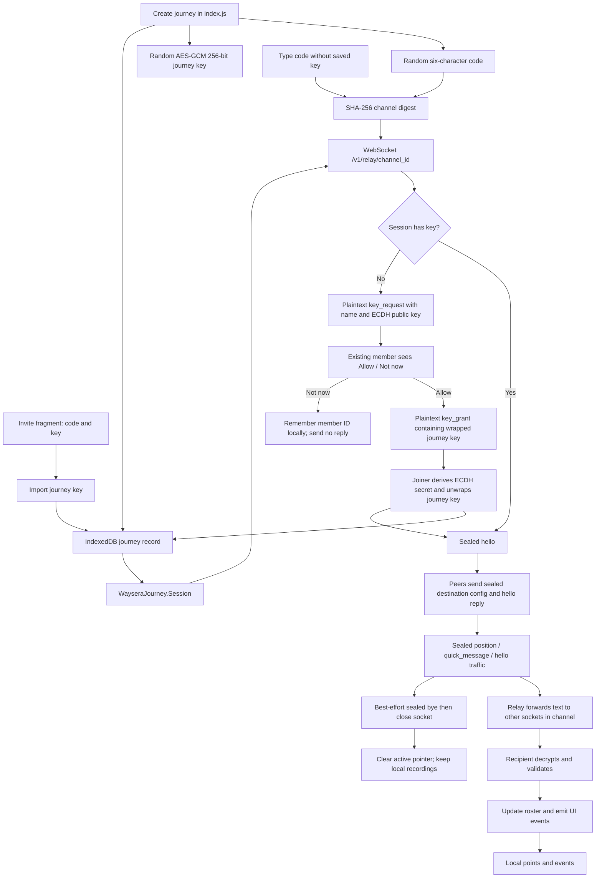
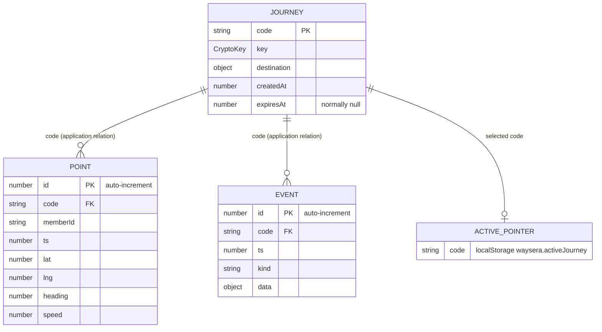

# Journey protocol and local records

This walkthrough describes source observed on 2026-09-12. It is a static trace of the checked-in implementation; the tests listed below were inspected, not executed for this document. Paths and line numbers identify the evidence behind each relationship.

## Create, join, exchange, and leave

The main page controller creates a six-character code, a separate AES-GCM journey key, and a local journey record before opening a session. A code selects the relay channel; possession of the journey key enables reading and writing the shared journey traffic. The channel digest is not an authorization token. See [index.js:73](../../web/frontend/assets/index.js#L73), [crypto.js:78](../../web/frontend/assets/crypto.js#L78), and [journey.js:106](../../web/frontend/assets/journey.js#L106).

The graph combines the alternative entry paths; an invite containing a key skips code-only approval. The controller reads a saved journey when starting a session, so a previously saved key also skips the handoff. See [index.js:157](../../web/frontend/assets/index.js#L157) and [index.js:2144](../../web/frontend/assets/index.js#L2144).

| Artifact | Observed responsibility and connections |
| --- | --- |
| [crypto.js:52](../../web/frontend/assets/crypto.js#L52) | Generates the code with WebCrypto randomness, normalizes it, validates its alphabet, and derives the lowercase SHA-256 channel digest. |
| [crypto.js:98](../../web/frontend/assets/crypto.js#L98) | Creates an extractable AES-GCM 256-bit journey key. `seal` encrypts JSON with a fresh 12-byte IV into `{iv, ct}`; `open` returns decoded JSON or `null` on malformed/tampered traffic. |
| [crypto.js:167](../../web/frontend/assets/crypto.js#L167) | Creates P-256 ECDH handoff pairs, derives an AES-GCM wrapping key, wraps/unwraps the journey key, and builds/parses invite fragments. |
| [journey.js:128](../../web/frontend/assets/journey.js#L128) | Converts the configured HTTP base to a WebSocket base and connects to `/v1/relay/{channelId}`. On open it announces or requests a key. Reconnect delay increases from 500 ms to 15 seconds; close codes 1008 and 1013 stop retries. |
| [journey.js:222](../../web/frontend/assets/journey.js#L222) | Sends sealed journey messages or a distinct plaintext `{hs: message}` handshake frame. A three-second heartbeat repeats a pending key request, sends the current position, or sends a hello reply. |
| [journey.js:300](../../web/frontend/assets/journey.js#L300) | Parses the envelope, routes handshakes, decrypts sealed frames, calls `WayseraValidate.validatePeerMessage`, ignores its own member ID, then updates state and emits events. |
| [validate.js:144](../../web/frontend/assets/validate.js#L144) | Rebuilds accepted messages from allowed fields. Validates coordinates and member IDs, normalizes names and heading, bounds numeric values, and resolves quick-message text from six local presets. |
| [index.js:212](../../web/frontend/assets/index.js#L212) | Subscribes to session events, adapts roster entries to `currentRoom.members`, updates UI/markers, saves granted keys/configuration, and records received positions and events. |
| [main.py:120](../../web/backend/main.py#L120) | Accepts the relay WebSocket, validates channel format, applies socket/frame/rate limits, and forwards opaque text through `RelayHub`. |
| [relay.py:61](../../web/backend/services/relay.py#L61) | Maintains the process-local `channel_id -> set of sockets` registry, excludes the sender, removes unreachable peers, and deletes empty channels. |

The protocol has seven accepted message types: `hello`, `position`, `quick_message`, `journey_config`, `key_request`, `key_grant`, and `bye`. Configuration is adopted only while the session has no destination; the session does not establish a cryptographically distinguished host. See [validate.js:40](../../web/frontend/assets/validate.js#L40) and [journey.js:329](../../web/frontend/assets/journey.js#L329).

For code-only admission, requests are retried using the same pending public key. A receiving device keeps the first request for a member ID; duplicates and replacements are ignored. Approval wraps the shared key for that public key. Denial is remembered by member ID in this session and produces no wire reply. See [journey.js:425](../../web/frontend/assets/journey.js#L425).

The roster is local derived state. A participant is live through 10 seconds, stale through 30 seconds, offline afterward, and removed after 120 seconds without sightings. The session republishes status every second. These timings do not indicate server-side membership or journey expiry. See [journey.js:30](../../web/frontend/assets/journey.js#L30) and [journey.js:390](../../web/frontend/assets/journey.js#L390).

## Relay boundary

The explicit application routes are `GET /`, `GET /v1/health`, and `WS /v1/relay/{channel_id}`. FastAPI is constructed with its standard documentation/OpenAPI defaults. `ALLOWED_ORIGINS` configures HTTP CORS; the WebSocket handler does not authenticate a user or enforce that CORS list. See [main.py:69](../../web/backend/main.py#L69) and [main.py:88](../../web/backend/main.py#L88).

| Guardrail | Checked-in value | Enforcement |
| --- | --- | --- |
| Channel format | 64 lowercase hexadecimal characters | [main.py:129](../../web/backend/main.py#L129); closes with 1008 |
| Frame size | 64 KiB of UTF-8 text | [main.py:152](../../web/backend/main.py#L152); closes with 1009 |
| Channel occupancy | 10 sockets, including sockets without a journey key | [relay.py:75](../../web/backend/services/relay.py#L75); closes with 1008 |
| Active channels | 5,000 per hub/process | [relay.py:78](../../web/backend/services/relay.py#L78); closes with 1013 |
| Send allowance | 20 messages/second per socket; burst 40 | [relay.py:19](../../web/backend/services/relay.py#L19) and [main.py:146](../../web/backend/main.py#L146); exhaustion closes with 1008 |

There is no payload persistence or history buffer in the relay implementation. New peers learn configuration from another currently connected client. Multiple independent worker processes would have separate registries unless a separate coordination layer were added. The logging filter scrubs 64-character lowercase hex strings from selected Python logger messages/arguments; this does not establish a guarantee about an external reverse proxy or hosting provider's logs. See [relay.py:64](../../web/backend/services/relay.py#L64), [relay.py:100](../../web/backend/services/relay.py#L100), and [main.py:36](../../web/backend/main.py#L36).

## Device records and replay inputs

`FK` labels above express application relationships, not database-enforced foreign keys. IndexedDB database `waysera`, version 1, contains three stores: `journeys` keyed by `code`; auto-increment `points` indexed by `[code, ts]` and `[code, memberId, ts]`; and auto-increment `events` indexed by `[code, ts]`. See [store.js:17](../../web/frontend/assets/store.js#L17) and [store.js:49](../../web/frontend/assets/store.js#L49).

The controller writes the full journey shape shown above when creating a journey. Records received via invite or key grant can initially contain only `code`, `createdAt`, and `key`; destination/configuration arrive later. IndexedDB stores the `CryptoKey` object directly. This is client storage, without an implemented additional layer of application-level encryption for the metadata, points, or events. See [index.js:99](../../web/frontend/assets/index.js#L99), [index.js:291](../../web/frontend/assets/index.js#L291), and [store.js:95](../../web/frontend/assets/store.js#L95).

Self GPS fixes and decrypted peer positions feed the recording buffer. The controller keeps at least a 2.5-second gap per member and flushes every five seconds. It then checks each affected member's point count; over 4,000 points, the store drops alternating points while retaining the first and last. Persisted points omit the live position's accuracy field. See [index.js:776](../../web/frontend/assets/index.js#L776), [index.js:1089](../../web/frontend/assets/index.js#L1089), and [store.js:152](../../web/frontend/assets/store.js#L152).

Events store `{code, ts, kind, data}`. Session events feed the log, and self quick messages are recorded locally because the relay does not echo them. Replay/export read each device's own observed recording; the relay cannot reconstruct missing history. Deleting a journey cascades to its points/events in one IndexedDB transaction. Leaving clears the active pointer and preserves the recording. See [index.js:950](../../web/frontend/assets/index.js#L950), [store.js:116](../../web/frontend/assets/store.js#L116), and [index.js:2055](../../web/frontend/assets/index.js#L2055).

## Verification artifacts

This table describes coverage encoded in source, not a claim of passing execution. Static counts are 88 browser test declarations and 23 backend test functions; parameterization can increase executed backend cases.

| Artifact | Traceable coverage / relationship |
| --- | --- |
| [backend/tests/test_relay.py:16](../../web/backend/tests/test_relay.py#L16) | Imports `main` and relay classes. Checks health routes, digest admission, channel isolation, forwarding without echo, opacity to arbitrary payload shape, limits, registry cleanup, token bucket refill, and log redaction. |
| [frontend/tests.html:50](../../web/frontend/tests.html#L50) | Loads crypto, validation, store, journey, export, replay, search, then `tests.js` in a real browser. |
| [frontend/tests.js:47](../../web/frontend/tests.js#L47) | Crypto tests: codes/digests, key import/export, seal/open, fresh IVs, wrong key/tampering, ECDH wrapping, and invite fragments. |
| [frontend/tests.js:268](../../web/frontend/tests.js#L268) | Input/DOM safety tests: escaping, text insertion, names, invalid/prototype-shaped types, coordinates, IDs, preset messages, and configuration. |
| [frontend/tests.js:448](../../web/frontend/tests.js#L448) | IndexedDB tests: `CryptoKey` round-trip, ordering, member/journey isolation, deletion cascade, and point thinning. |
| [frontend/tests.js:552](../../web/frontend/tests.js#L552) | Session tests replace `rawSend` to connect two sessions directly. Covers rosters, config, approved/denied code admission, retry/stop behavior, handshake envelope, peer departure, and preset-message behavior. This does not exercise real WebSockets. |
| [frontend/tests.js:960](../../web/frontend/tests.js#L960) | Export tests check grouping, event-derived names, JSON/GPX formatting, absence of exported journey key, and XML escaping. Replay tests check interpolation. Search tests check formatting, coordinate order, bias, and remembered position. |
| [tools/run_browser_tests.py:72](../../web/tools/run_browser_tests.py#L72) | Starts a temporary static server and Chrome profile, opens `tests.html`, and receives results posted to `/__results` by [tests.js:1218](../../web/frontend/tests.js#L1218). |
| [tools/integration_test.py:173](../../web/tools/integration_test.py#L173) | Uses a real relay and two Chrome pages to create/join by invite, exchange positions/config/quick messages, observe ciphertext, check absence of buffered history, inspect recordings, and open replay. Code-only approval is covered by the direct-session suite, not this integration scenario. |
| [tools/smoke_app.py:90](../../web/tools/smoke_app.py#L90) | Loads the actual page and checks required globals, journey/key persistence, voice repeat suppression/muting, and destination popup injection handling; a relay is not required by this scenario. |
| [tools/check_layouts.py:30](../../web/tools/check_layouts.py#L30) | Checks index/replay horizontal overflow at six widths and two color schemes. `WAYSERA_WEB_ROOT` allows targeting Android's copied web assets. |

The integration scenario creates two tabs under the same Chrome profile and static origin, so they share origin-scoped IndexedDB. Its two point-count reads do not by themselves prove independent-device storage isolation, even though it exercises real relay transport. See [integration_test.py:142](../../web/tools/integration_test.py#L142), [integration_test.py:176](../../web/tools/integration_test.py#L176), and [integration_test.py:338](../../web/tools/integration_test.py#L338).

## Claims to keep qualified

- **Journey traffic versus handshakes:** [README.md:40](../../README.md#L40), [crypto.js:4](../../web/frontend/assets/crypto.js#L4), and the backend introduction broadly describe ciphertext-only forwarding. [journey.js:10](../../web/frontend/assets/journey.js#L10) and [journey.js:227](../../web/frontend/assets/journey.js#L227) show the exception: plaintext handshakes reveal the requester's name/member ID and ephemeral public keys; the granted journey key is wrapped.
- **Human approval:** ECDH protects the exchange against a passive observer under its assumptions. Display-name approval is a human admission step; it does not cryptographically authenticate a person/public key or defeat an active relay that substitutes the initial public key. The source itself acknowledges the active-relay issue at [journey.js:21](../../web/frontend/assets/journey.js#L21). Shared-key authentication also does not identify which member sent a message; member IDs are supplied in message fields.
- **Local storage scope:** [store.js:10](../../web/frontend/assets/store.js#L10) says localStorage holds only the active pointer. Other modules also store the remembered name ([index.js:46](../../web/frontend/assets/index.js#L46)), voice setting ([index.js:1382](../../web/frontend/assets/index.js#L1382)), last search position ([search.js:80](../../web/frontend/assets/search.js#L80)), and recent destinations ([destination-picker.js:86](../../web/frontend/assets/destination-picker.js#L86)).
- **Validation behavior:** The introductory claim that validators never repair malformed messages ([validate.js:10](../../web/frontend/assets/validate.js#L10)) is broader than the code. Names are normalized/truncated, heading wraps, some invalid optional fields become `null`, and invalid/missing timestamps fall back to local time. Validation is not a replay/freshness check.
- **Expiry:** `expiresAt` remains in messages and stored records, but new journeys set it to `null` and the UI timer displays `Live`; the relay has no journey-expiry enforcement. See [index.js:104](../../web/frontend/assets/index.js#L104) and [index.js:742](../../web/frontend/assets/index.js#L742).
- **Test timeout configuration:** [pytest.ini:7](../../web/backend/pytest.ini#L7) specifies `timeout = 10`, but [requirements-dev.txt:1](../../web/backend/requirements-dev.txt#L1) does not declare `pytest-timeout`. The configuration alone does not establish that a ten-second ceiling is enforced in a fresh environment.
